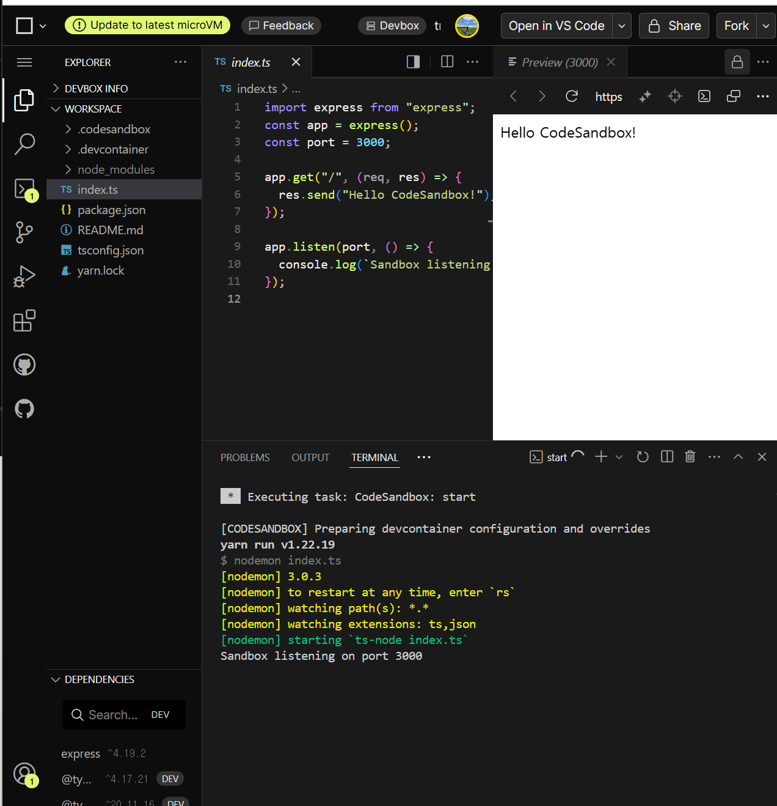

# Chapter 2

## 1. codesandbox 계정 만들기

- 배포없이 바로 확인해볼 수 있는 사이트!
- 되도록 Github 계정으로 가입하는 것을 추천한다.

## 2. nodejs 설정



## 3. express 설정

[express 공식문서](https://expressjs.com/ko/starter/hello-world.html)

```js
const express = require("express");
const app = express();
const port = 3000;

app.get("/", (req, res) => {
  res.send("Hello World!");
});

app.listen(port, () => {
  console.log(`Example app listening on port ${port}`);
});
```

- 앱은 서버를 시작하며 3000번 포트(` http://localhost:3000/`)에서 연결을 청취합니다. 앱은 루트 URL(/) 또는 라우트에 대한 요청에 “Hello World!”로 응답합니다. 다른 모든 경로에 대해서는 `404 Not Found`로 응답합니다.

- express의 골격을 신속하게 작성하려면 애플리케이션 생성기 도구인 express를 사용하세요.

```bash
npm install express-generator -g

express --view=pug myapp
```

`_myapp_`라는 이름의 express 앱을 현재 작업 디렉토리에 작성한다.

## 4. 기본적인 라우팅 설정

### Basic routing

- Routing refers to determining how an application responds to a client request to a particular endpoint, which is a URI (or path) and a specific HTTP request method (GET, POST, and so on).

- Each route can have one or more handler functions, which are executed when the route is matched.

<br>
Route definition takes the following structure:

`app.METHOD(PATH, HANDLER)`

- `app` is an instance of express.
- `METHOD` is an HTTP request method, in lowercase.
- `PATH` is a path on the server.
- `HANDLER` is the function executed when the route is matched.

### Examples

```js
app.get("/", (req, res) => {
  res.send("Hello World!");
});
```

```js
app.post("/", (req, res) => {
  res.send("Got a POST request");
});
```

```js
app.put("/user", (req, res) => {
  res.send("Got a PUT request at /user");
});
```

```js
app.delete("/user", (req, res) => {
  res.send("Got a DELETE request at /user");
});
```
