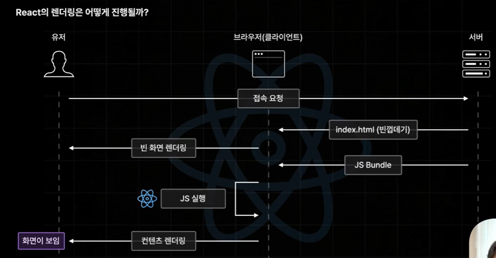
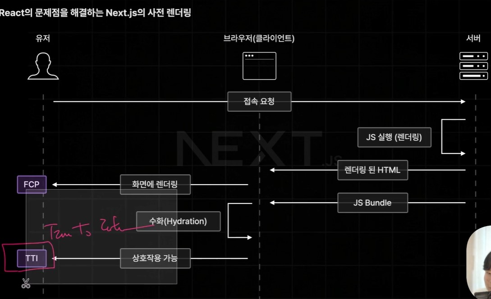
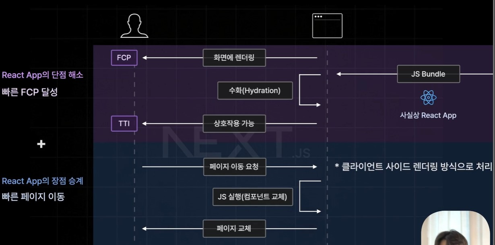
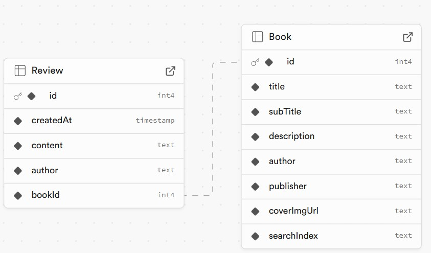
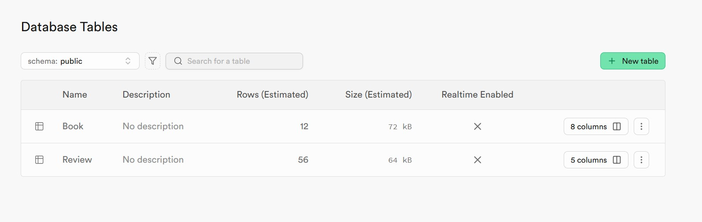

# Chapter1

## 1. Next.js를 소개합니다.

- React를 좀 더 간편하게 사용할 수 있는 기술
  React + (페이지 라우팅, 빌트인 최적화 기능, 다이나믹 HTML 스트리밍)
- vercel에서 개발한 오픈소스

### 왜 이렇게 인기가 많을까?

- Next.js는 라이브러리가 아닌 Framework로 만들어졌기 때문이다.
- React는 UI 개발을 위한 JavaScript "library"
  => 기능 구현의 주도권이 누구에게 있는지에 따라 나뉜다.

### Next.js Library가 아닌 Framework입니다.

- 주도권이 개발자에게 있다 : Library

- 주도권이 개발자에게 없다 : Framework
  프레임워크가 제공하는 기능을 이용하거나 허용하는 범위 내에서만 추가 도구 사용이 가능하다.

  e.g. 라우터를 구현하고 싶어!

  - react : react-router를 써도 되고, tanstack을 써도 돼!
  - Next : Next.js에서 제공하는 Page Router, App Router를 사용해야해!

=> 프레임워크는 자유도가 상대적으로 낮다.

### Q. 자유도가 높을수록 좋은거 아닌가요?

- 기본 기능 외 제공 X => 내가 필요한 기능에 따라서 마는 것을 찾아서 사용해야한다!

e.g. Page Routing, Optimizations, Server Pre Rendering 등 기본 제공

## 2. Next.js 사전렌더링 이해하기

### CSR(Client Side Rendering)



- 기존의 리액트 앱의 CSR(Client Side Rendering)은 초기 접속 이후 페이지 이동을 빠르게 처리 가능 but 초기 접속이 느리다.

### 사전렌더링



- 브라우저의 요청에 사전에 렌더링이 완료된 HTML을 응답하는 렌더링 방식
- Client Side Rendering의 단점을 효율적으로 해결하는 기술
- JS 코드가 html에 적용되는 Hydration /



## 3. 실습용 백엔드 서버 세팅하기

### 초기 설정

- 실전과 같은 환경에서 공부할 수 있도록 백엔드 서버 세팅하기  
  (1) [실습용 백엔드 서버](https://github.com/winterlood/onebite-books-server)  
  (2) [Supabase](https://supabase.com/)

```bash
// 의존성 설치하기
npm i

// DB를 초기화하기
npx prisma db push

// => ✔ Generated Prisma Client (v5.13.0) to .\node_modules\@prisma\client in 51ms


```



- supabase에 DB가 생성된 것을 확인할 수 있다.

### 초기 데이터 넣기

```bash
// 초기 데이터 추가하기
npm run seed
```



- 추가 데이터가 생성되었다.

### 실행하기

```bash
npm run build

npm run start
```

- 'localhost:12345' 접속시 사용 가능
- 'localhost:12345/api' 접속시 API 문서 확인 가능
- `npx prisma studio`를 통해서 DB를 사용 가능

## 4. 본격적인 학습에 앞서

(1) Next.js란 어떤 기술인지?
(2) 사전 렌더링이란?
(3) 백엔드 설정

### Next.js에서 제공하는 라우터

- 페이지 라우터 : Next 초창기부터 제공되어 오던 구 버전의 라우터

- 앱 라우터 : Next 13버전과 함께 처음으로 공개된 신규 라우터
  다양한 신규 기능이 제공된다. ( 서버 컴포넌트 등...)
